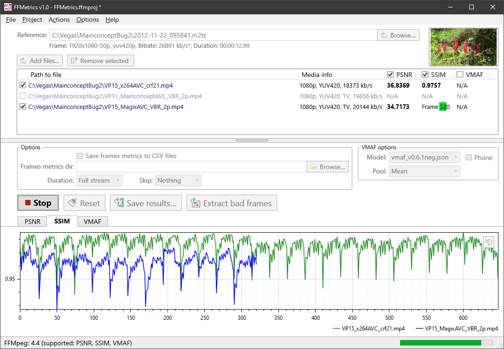

## FFMetrics -- Yet another program for Video Quality Metrics calculation and visualisation

FFMpeg can be used for calculating different visual quality metrics. FFMetrics is a FFMpeg GUI, so all calculations are done by FFMpeg.
The program allow you to select analyzed files without dealing with command line and calculate metrics in one go.

Well, and build shiny graphs of course:

## Features
- PSNR, SSIM, VMAF visual quality metrics
- Easy to use UI: drag & drop files from Explorer onto Reference field and Files list or use file choosers
- Processing up to 12 files in one go.
- No limitations on frame size for PSNR/SSIM, Full HD/4K for VMAF
- Per frame graphs can be zoomed in/out with mouse wheel (try it over graph or axes) and panned with right mouse button
- Per frames metrics can be saved as tab-delimited csv files (created aside of source files and named as file.mp4.PSNR.csv), so you can easily open them in Excel
- FFMpeg commands can be saved to log (FFMetrics.log)
- Per file results can be saved to tab-delimited csv file (FFMetrics.Results.csv)
- VMAF model can be selected from UI (4K videos require different model)

## Latest version
**[0.7.0 Beta](FFMetrics/releases)**

## Requirements
- .NET Framework 4.7.2 Runtime. Program should notify if you need to install it.
  The framework is already included in Windows 10 1803 and above, but if you use Windows 7 or earlier versions of Windows 10, you may need to [download](https://dotnet.microsoft.com/download/dotnet-framework/net472) and install it.
- FFMpeg.exe. You need to download it from [official web site](https://ffmpeg.org/download.html) (choose static build for simplicity).
- VMAF require special FFMpeg's build that supports it. It is supported in stable version 4.3.
  In addition, model files must be in sub-folder "vmaf-models". Two most common models are already included in archive.

## How to use
- Unpack into a folder
- Put FFMpeg.exe (and dll files if you decided to get dynamic version) into the program folder or make it available in system %PATH%
- Run the program
- Use UI to add reference file and processing file(s). You can drag & drop files or use Browse/Add buttons.
- Click "Calculate" button

## Limitations
- Slower than [similar program](https://tools4vegas.com/render-quality-metrics-ffmpeg/) from @wwaag
- No MSE, no libvmaf's PSNR & SSIM (ffmpeg can calculate PSNR & SSIM in two different ways and values that you can get using different methods are not the same)
- ffmpeg.exe sometimes gives too low results (to be investigated)

## ToDo
- Config file for metrics
- Command line options
- Visual controls for graphs manipulating & saving
- More than 12 files
- More options: folder for logs, ...
- Separate graphs from main program window?
- Icon

## Author
fifonik [[blog](http://fifonik.com/blog/)]
