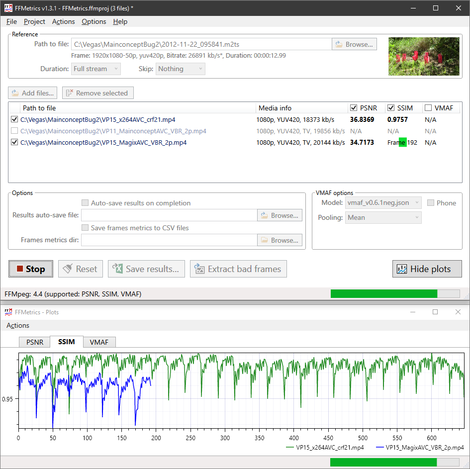

## FFMetrics — yet another program for video Visual Quality Metrics visualization

FFMpeg can be used for calculating different visual quality metrics (PSNR, SSIM, VMAF). 
FFMetrics is a FFMpeg GUI that purpose is to visualize quality metrics calculated by FFMpeg.
The program allows you to select files without dealing with command line, calculate & visualize PSNR, SSIM & VMAF quality metrics for all of them in one go.

Well, and build shiny interactive graphs of course:

## Features
- PSNR, SSIM, VMAF visual quality metrics;
- Processing up to 24 files in one go (this can be increased by configuring graphs' styles) ;
- No limitations on frame size for PSNR/SSIM, Full HD/4K for VMAF;
- Brief media info for reference and distorted files;
- Thumbnail for reference file;
- “Bad” frames can be extracted and saved as PNG images for further analisys;
- Only parts of video files can be analyzed;
- Easy to use UI: drag & drop files from Explorer onto Reference field and Files list or use file choosers;
- Frames graphs can be zoomed in/out with mouse wheel (try it over graph or graph's axes), panned with right mouse button and saved as SVG or PNG;
- Frames metrics can be saved as tab-delimited **csv** files and then opened in Excel;
- FFMpeg commands issued by FFMetrics can be saved to log file (`FFMetrics.log`);
- Average metrics, frames statistics, frame size, bitrate, date/time and file name can be saved to tab-delimited **csv** file (appended) and then opened in Excel;
- VMAF model selected automatically based on reference media info, but can be changed using UI;
- Supported VMAF models type (**in-build in FFMpeg**, **pkl** or **json**) detected automatically;
- Most program options could be supplied as command line parameters;
- Free. No registration, banners, tracking etc.

## Latest version: 
- Stable: [1.3.1](https://github.com/fifonik/FFMetrics/releases/tag/v1.3.1)
- Stable (previous): [1.0.0](https://github.com/fifonik/FFMetrics/releases/tag/v1.0.0)

## Requirements
- .NET Framework 4.8.0 or later. The framework is already included since Windows 10 1903 so you do not need to install it separately. However, if you use earlier versions of Windows 10 or Windows 7/8, the program should ask you to [download](https://dotnet.microsoft.com/download/dotnet-framework/net48) and install it.
- FFMpeg.exe. You need to download it from [official ffmpeg web site](https://ffmpeg.org/download.html). You can try static build for simplicity. However, for real usage I'd recommend to use shared build.
- VMAF metric require special FFMpeg's build. It is supported since FFMpeg version 4.3 (stable). However, you'd better use FFMpeg 4 or newer.
  In addition, VMAF model files must be in sub-folder `vmaf-models`. The most common models are already included in archive. You can get other models from [Netflix VMAF project](https://github.com/Netflix/vmaf/)
  If you use the most recent FFMpeg builds, the vmaf models could be in-build into it so you do not need to use separate vmaf models.

## How to use
- Unpack into a folder;
- Put FFMpeg.exe (and accompanied dll files if you use shared build) into the program folder or make it available through system %PATH%;
- Run the program;
- Use UI to add reference file and at least one distorted file (you can drag & drop files from Explorer or use file choosers);
- Select metrics you'd like to calculate;
- Click “Start” button.

## How to run with command line options
**FFMetrics.exe \[options\] ref.mp4 file1.mp4 \[file2.mp4\] \[file3.mp4\] \[...\]**

### Accepted options
    -auto-save-results                     After calculation save results to log
    -auto-save-results-file=C:\path\file.csv
    -duration=<seconds>                    Duration of video stream to be processed
                                           Default: 0 (whole stream used)
    -log-commands                          Log ffmpeg commands
    -log-frames                            Log frames' metrics in csv files
    -log-frames-dir=C:\path\               Folder where frame's metrics will be stored
    -log-level=DEBUG|ERROR|INFO            Default: INFO
    -metric=PSNR|SSIM|VMAF                 Default: all (-metric=PSNR -metric=SSIM -metric=VMAF)
    -plot-update-speed=HIGH|NORMAL|LOW|OFF Plots update frequency
                                           Default: NORMAL
    -plot-window-manual                    Do not open plot window automatically when starting calculation
    -project=C:\path\to\project.ffmproj    Read project options from specified file
    -run                                   Run calculation when program started
    -scaling-method=NEIGHBOR|GAUSS|BILINEAR|BICUBIC|LANCZOS|SINC|SPLINE
                                           Default: BICUBIC
    -skip=<seconds>                        Duration of video stream to be skipped
                                           Default: 0 (stream processed from the beginning)
    -temp-dir=dirspec                      Default: default user temporary directory
    -vmaf-model=filename                   Default: detected automatically based on reference media info
    -vmaf-phone-model
    -vmaf-pool=MEAN|HARMONIC_MEAN          Default: MEAN

All options can be provided using single leading dash (-option) or double leading dash (--option).

#### Examples
`FFMetrics.exe \\server\path\to\ref.mp4 "c:\path\to\my file.mp4"` 
`FFMetrics.exe -log-frames -metric=SSIM -metric=VMAF -run c:\to\ref.mp4 c:\to1\file1.avi c:\to2\file2.avs` 
`FFMetrics.exe -project=c:\path\to\project.ffmproj -vmaf-pool=harmonic_mean -run` 

## Limitations
- You have to be very careful and supply video files in the same colour range or with correct colour range's meta. Otherwise ffmpeg.exe could make incorrect transformation and give you incorrect results ([more details](https://www.vegascreativesoftware.info/us/forum/magicyuv-2-20-released--117638/?page=3#ca772279)). I do have plans to improve the program to prevent/minimize this happen.

## Troubleshooting
- Close FFMetrics and delete `FFMetrics.log`;
- Run the program with option `-log-level=debug`;
- In program menu activate “Options | Write FFMpeg commands to log” (required for version below 1.3.0);
- Add reference file;
- Add one distorted file and make it active (checkbox on the left of filename must be ticked);
- Make sure at least one metric is active (checkbox on the left of metric name must be ticked);
- Click “Start” button;
- Take screenshot (Alt+PrnScr or Win+Shift+S and paste it into image editor and save as PNG);
- Close the program;
- Analyze `FFMetrics.log`. You can try to run the ffmpeg command directly;
- Upload archived `FFMetrics.log` with screenshot to dropbox (or similar) and share the link.

### Common issues
1. “Start” button disabled
    - No FFMpeg.exe found;
    - No reference file added, reference file does not exist (red file name) or program is unable to get file's media info;
    - No distorted file added, distorted file does not exist (red file name), program unable to get file's media info or no active distorted files (files with checkbox on the left of the file name ticked);
    - No metrics selected.
2. VMAF checkbox disabled
    - FFMpeg.exe does not support VMAF. [Download](https://ffmpeg.org/download.html) newer version, make sure it supports VMAF.
    - No `vmaf-models` folder with supported models in it. FFMpeg might support **pkl** model but there are only **json** models in the folder or visa versa.
    - Program path contains non-English characters. FFMetrics itself should not have issues with non-English characters in paths, but FFMpeg.exe could fail while trying to open VMAF model file during FFMpeg feature-detection startup process.
3. Error while calculating VMAF metric
    - Invalid VMAF model file. The first thing that you should check if you downloaded models on you own. Model file must be less than 30KB and should not contain HTML in it.
4. I'm trying to calculate VMAF metric comparing the file with itself and **not** getting score 100.
    - Based on [VMAF FAQ](https://github.com/Netflix/vmaf/blob/master/FAQ.md#q-when-i-compare-a-video-with-itself-as-reference-i-expect-to-get-a-perfect-score-of-vmaf-100-but-what-i-see-is-a-score-like-987-is-there-a-bug) this is by design.

## Author
fifonik

## Discussions
- [Discussion in Vegas forum](https://www.vegascreativesoftware.info/us/forum/ffmetrics-yet-another-program-for-quality-metrics-calculation--122246/) (in English)
- [Discussion in IXBT forum](https://forum.ixbt.com/topic.cgi?id=29:36847) (in Russian)
